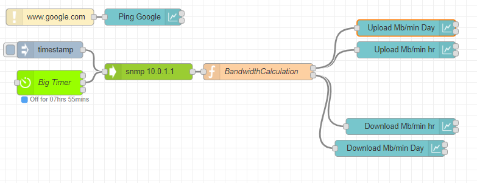

# Introduction

This node-red flow uses **snmp** to monitor the **WAN0** port on a 4th Generation Apple AirPort Extreme.

## Background

I was having some network issues and realized that I didn't have any sort of overall network monitoring of my router.

I've got a rather old (4th generation) Apple AirPort Extreme that has been the most reliable wireless router I've ever owned.  One of the great things about this particular model is that it still supports **snmp**.  So doing a little google-fu, I put together a node-red flow which monitors the main WAN port.

## SNMP

Ok, so I will be upfront and honest, before today I've done literally nothing with SNMP, so all of this was by trial and error.

I downloaded a couple of MIB browsers and was able to determine that these two addresses were what I was interested in.

`1.3.6.1.2.1.2.2.1.10.6` WAN0 Input -- upload to the internet  
`1.3.6.1.2.1.2.2.1.16.6` WAN0 Output -- download from the internet

## Process

Once a minute the flow grabs the latest value of both counters from the router, converts it to megabytes and then computes the delta from the last time.  There's a little bit of error checking incase the calculation goes negative, which is probably an indicator that the counter reset to 0.

I then put two graphs, one which tracks for the last hour, and the other tracks for the last day.

## Dependencies

This flow uses the following dependencies.

* [Node Red](https://nodered.org/)
* [node-red-contrib-bigtimer](https://www.npmjs.com/package/node-red-contrib-bigtimer)
* [node-red-node-snmp](https://flows.nodered.org/node/node-red-node-snmp)
* [node-red-dashboard](https://flows.nodered.org/node/node-red-dashboard)

## Screenshots

  

